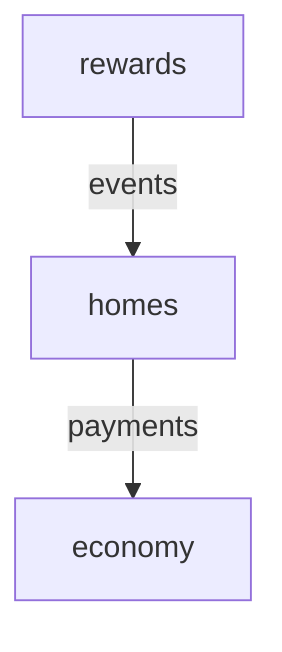

# MinecraftModulith

[](https://jitpack.io/#el211/MinecraftModulith)
[](https://openjdk.org/projects/jdk/21/)
[](https://papermc.io/)
[](LICENSE)

**Spring Modulith-inspired architecture for modern Minecraft plugins.**

MinecraftModulith helps you build large Paper/Folia plugins as a set of explicit, testable modules instead of one tightly coupled codebase. It provides module boundaries, named APIs, dependency validation, lifecycle management, events, diagnostics, configuration, scheduling adapters, and test utilities while still producing a normal Minecraft plugin.

> **Current release:** `v0.3.0`  
> **Java:** 21  
> **Platform:** Paper 1.21.x + Folia-aware scheduling

## Why MinecraftModulith?

Large plugins often grow into a web of managers, listeners, services, commands, and direct implementation dependencies.

MinecraftModulith gives those systems explicit boundaries:

```text
YourPlugin
├── economy
│   ├── public API
│   └── internal implementation
├── homes
├── warps
├── rewards
└── moderation
```

A module can expose only the API another module is allowed to use:

```java
@ModuleApi("payments")
public interface EconomyService {
    long balance(UUID playerId);
}
```

And consumers can depend on that named API instead of the entire implementation:

```java
@PluginModule(
    value = "homes",
    dependencies = "economy::payments"
)
public final class HomesModule implements MinecraftModule {
}
```

That means fewer accidental dependencies, safer refactors, clearer startup order, and architecture problems caught before they become runtime bugs.

## Installation

MinecraftModulith is available through **JitPack**.

### Gradle Kotlin DSL

```kotlin
repositories {
    mavenCentral()
    maven("https://jitpack.io")
    maven("https://repo.papermc.io/repository/maven-public/")
}

dependencies {
    implementation("com.github.el211.MinecraftModulith:modulith-paper:v0.3.0")

    annotationProcessor(
        "com.github.el211.MinecraftModulith:modulith-processor:v0.3.0"
    )

    // Optional: pick one or more persistence backends
    implementation(
        "com.github.el211.MinecraftModulith:modulith-events-sqlite:v0.3.0"
    )
    implementation(
        "com.github.el211.MinecraftModulith:modulith-events-jdbc:v0.3.0"
    )
    implementation(
        "com.github.el211.MinecraftModulith:modulith-events-mongodb:v0.3.0"
    )

    testImplementation(
        "com.github.el211.MinecraftModulith:modulith-test:v0.3.0"
    )
}
```

For platform-independent usage, use `modulith-core` instead of `modulith-paper`.

### Published modules

| Artifact | Purpose |
| --- | --- |
| `modulith-core` | Platform-independent module runtime, events, services and diagnostics |
| `modulith-paper` | Paper/Folia bootstrap, scheduler, commands and YAML configuration |
| `modulith-processor` | Compile-time module and architecture validation |
| `modulith-events-sqlite` | Persistent event publication tracking through SQLite |
| `modulith-events-jdbc` | Persistent event publication tracking through any JDBC data source (PostgreSQL, MySQL, MariaDB, H2, SQL Server, …) |
| `modulith-events-mongodb` | Persistent event publication tracking through MongoDB |
| `modulith-test` | Module-focused test harness and architecture assertions |

All modules use:

```text
com.github.el211.MinecraftModulith:<artifact>:v0.3.0
```

[JitPack build page](https://jitpack.io/#el211/MinecraftModulith/v0.3.0)

## Quick start

Create a module:

```java
@PluginModule("economy")
public final class EconomyModule implements MinecraftModule, EconomyService {

    @Override
    public void enable(ModuleContext context) {
        context.services().publish(EconomyService.class, this);
    }

    @Override
    public long balance(UUID playerId) {
        return 0L;
    }
}
```

Expose a named API:

```java
@ModuleApi("payments")
public interface EconomyService {
    long balance(UUID playerId);
}
```

Consume it from another module:

```java
@PluginModule(
    value = "homes",
    dependencies = "economy::payments"
)
public final class HomesModule implements MinecraftModule {

    @Override
    public void enable(ModuleContext context) {
        EconomyService economy = context.services()
            .require(EconomyService.class);
    }
}
```

MinecraftModulith validates the declared dependency graph and keeps modules from reaching into implementation details they should not access.

## Paper bootstrap

```java
public final class MyPlugin extends JavaPlugin {

    private PaperModulith modulith;

    @Override
    public void onEnable() {
        modulith = PaperModulith.builder(this)
            .basePackage("dev.example.myplugin")
            .start();
    }

    @Override
    public void onDisable() {
        if (modulith != null) {
            modulith.close();
        }
    }
}
```

The runtime discovers modules, validates their dependencies, starts them in deterministic order, and shuts them down safely.

## Compile-time architecture validation

Add `modulith-processor` as an annotation processor and invalid architecture can fail during compilation.

The processor detects issues such as:

- duplicate or missing module IDs
- invalid dependency selectors
- access to another module without a declared dependency
- access to types that are not exposed through `@ModuleApi`
- access to another module's `internal` package
- invalid or non-public module API declarations

Example:

```text
Module 'homes' cannot access internal type
dev.example.economy.internal.EconomyRepository
from module 'economy'
```

## Module events

Use `@ModuleListener` for decoupled module communication.

### Synchronous listener

```java
@ModuleListener
public void onHomeCreated(HomeCreatedEvent event) {
}
```

### Async listener

```java
@ModuleListener(
    id = "rewards.home-created",
    delivery = EventDelivery.ASYNC
)
public CompletionStage<Void> onHomeCreated(HomeCreatedEvent event) {
    return CompletableFuture.runAsync(() -> reward(event.playerId()));
}
```

Publishing supports completion policies:

```java
context.events().publish(event, EventCompletionPolicy.WAIT_FOR_ALL);
context.events().publish(event, EventCompletionPolicy.FAIL_FAST);
context.events().publish(event, EventCompletionPolicy.FIRE_AND_FORGET);
```

`publishAsync(...)` returns a `CompletionStage<EventDispatchResult>`.

## Persistent event publications

The optional `modulith-events-sqlite` module records event delivery state in SQLite.

```java
var registry = new SqliteEventPublicationRegistry(
    plugin.getDataFolder()
        .toPath()
        .resolve("modulith-events.db")
);

modulith = PaperModulith.builder(plugin)
    .basePackage("dev.example.plugin")
    .publicationRegistry(registry)
    .start();
```

Tracked information includes:

- publication UUID
- event type
- listener ID
- serialized payload
- `PENDING`, `COMPLETED`, or `FAILED`
- publication/completion timestamps
- failure information

Incomplete publications can be queried with:

```java
registry.incomplete();
```

## JDBC publication registry (PostgreSQL, MySQL, MariaDB, …)

The `modulith-events-jdbc` module works with any JDBC-compatible database. Add your driver
as a runtime dependency and pass any `javax.sql.DataSource` to the registry.

```kotlin
// build.gradle.kts — example with PostgreSQL
implementation("com.github.el211.MinecraftModulith:modulith-events-jdbc:v0.3.0")
runtimeOnly("org.postgresql:postgresql:42.7.4")
```

```java
// Minimal setup with a plain DriverManager DataSource
PGSimpleDataSource dataSource = new PGSimpleDataSource();
dataSource.setURL("jdbc:postgresql://localhost:5432/myplugin");
dataSource.setUser("user");
dataSource.setPassword("secret");

var registry = new JdbcEventPublicationRegistry(dataSource);

modulith = PaperModulith.builder(plugin)
    .basePackage("dev.example.plugin")
    .publicationRegistry(registry)
    .start();
```

The schema (`modulith_event_publication`) is created automatically on first use.
Use a connection pool such as HikariCP for production workloads.

## MongoDB publication registry

The `modulith-events-mongodb` module stores event publications in a MongoDB collection.

```kotlin
// build.gradle.kts
implementation("com.github.el211.MinecraftModulith:modulith-events-mongodb:v0.3.0")
```

```java
MongoClient client = MongoClients.create("mongodb://localhost:27017");
MongoCollection<Document> collection = client
    .getDatabase("myplugin")
    .getCollection("modulith_event_publication");

var registry = new MongoEventPublicationRegistry(collection);

modulith = PaperModulith.builder(plugin)
    .basePackage("dev.example.plugin")
    .publicationRegistry(registry)
    .start();
```

An index on the `status` field is created automatically on construction.

## Module configuration

Modules can opt into their own YAML configuration:

```java
@PluginModule(
    value = "homes",
    configuration = true
)
public final class HomesModule implements MinecraftModule {

    @Override
    public void enable(ModuleContext context) {
        String command = context.config()
            .getString("command-name", "home");
    }
}
```

On Paper, module configuration is stored under:

```text
plugins/<YourPlugin>/modules/<module>.yml
```

Bundled module YAML files can be copied from the plugin JAR as defaults.

## Paper & Folia scheduling

MinecraftModulith provides a scheduler abstraction so module code does not need to care whether it is running on standard Paper or Folia.

```java
PaperPlatform paper = context.platform(PaperPlatform.class);

paper.schedule(context, this::tick);
paper.scheduleLater(context, this::later, 20L);
paper.scheduleTimer(context, this::tick, 0L, 20L);
```

MinecraftModulith detects Folia's global region scheduler when available and otherwise uses Paper's `BukkitScheduler`.

Scheduled tasks owned by a module are cancelled automatically when that module stops.

## Module-owned commands

Commands can be registered dynamically without declaring every command in `plugin.yml`.

```java
paper.registerCommand(
    context,
    "home",
    "Create a home",
    (sender, command, label, args) -> {
        return true;
    }
);
```

Registered commands are cleaned up with their owning module lifecycle.

## Dependency graph export

The runtime can export the module graph for documentation and diagnostics.

```java
String mermaid = modulith.runtime().graphMermaid();
String graphviz = modulith.runtime().graphGraphviz();
```

Example:



## Metrics & diagnostics

```java
RuntimeDiagnostics diagnostics = modulith.runtime().diagnostics();
```

The diagnostics snapshot exposes information such as:

- module states
- deterministic startup order
- published service count
- module startup duration
- module start/stop counters
- event publication count
- listener invocation/completion/failure counters
- total listener execution time
- incomplete persistent publications

You can bridge these diagnostics into Prometheus, Micrometer, a web dashboard, or your own telemetry system.

## Module-focused testing

`modulith-test` lets tests start only a target module and its required dependencies.

```java
try (ModuleTestHarness harness = ModuleTestHarness.builder()
        .modules(List.of(EconomyModule.class, HomesModule.class))
        .target("homes")
        .start()) {

    harness
        .assertRunning("economy")
        .assertRunning("homes")
        .assertStartupOrder("economy", "homes");
}
```

Architecture helpers are also available:

```java
ModuleAssertions.assertValidArchitecture(modules);
ModuleAssertions.assertMermaidContains(runtime, "homes");
```

## Experimental next-generation APIs (feature branch)

These APIs are being developed on `feat/modulith-architecture-and-runtime` and are not part
of the published v0.3.0 artifact. The original class-based module declaration remains supported.

### Package-based module declaration

Use `package-info.java` to declare a package module. Annotation processing generates
a `__MinecraftModulithModule` lifecycle anchor, which Paper's normal discovery can load:

```java
@ApplicationModule(id = "homes", allowedDependencies = {"economy::payments"})
package dev.example.homes;
import dev.oreo.modulith.core.ApplicationModule;
```

Named interfaces can be declared with `@NamedInterface("payments")` on an API package.
Use `@ModuleComponent` for constructor-injected components and `@Inject` to select a constructor
when the component has multiple constructors. Public cross-module interfaces need `@ModuleApi`
or a named-interface package; all cross-module service lookup still checks declared dependencies.

### Recovery, configuration and scheduling

`EventPayloadCodec` adds payload deserialization, allowing explicit at-least-once replay
of pending events through `events.replayIncomplete(limit)`. Call only after listeners
have registered and only from a single recovery worker for a given publication registry.
Handlers must be idempotent. Failed publications can be retried explicitly via
`events.replayFailed(limit)` or quarantined with `events.deadLetter(id, reason)`.
The SQLite, JDBC and MongoDB adapters support separate FAILED and DEAD_LETTER states.
JDBC also offers `begin(Connection, type, listener, payload)` for caller-managed SQL
transactions; MongoDB offers `begin(ClientSession, type, listener, payload)` for
caller-managed Mongo transactions. Both defer commit control to the application.
Use the single-worker `EventRetryCoordinator` to periodically process FAILED records with
persisted retry counts, exponential backoff and a bounded dead-letter threshold. Schedule
`tick(now, batchSize)` on the correct platform execution context for your listeners.
Attempts are stored in a separate SQL retry table or MongoDB document field; existing
publication tables do not require destructive migration. **Multi-instance leases and
exactly-once delivery are not implemented**, so use one recovery worker per registry.

`context.config(MySettings.class)` reads a typed immutable record snapshot and supports
`@ConfigKey` and `@ConfigRange`.

`context.platform(PaperPlatform.class).contexts()` exposes global, entity, region and
async scheduling. Folia entity/region operations should use their own execution context.
All returned task handles belong to their module's lifecycle.

### Optional administrator diagnostics

Enable `diagnosticsCommand(true)` on `PaperModulith.Builder` to register Paper's
lifecycle-based `/modulith modules|events|graph` command. Access requires
`minecraftmodulith.admin`. The separate observability artifact offers
dependency-free Prometheus exposition and an opt-in OpenTelemetry reporter.

### JUnit module tests

```java
@MinecraftModuleTest(
    value = "homes",
    modules = {EconomyModule.class, HomesModule.class}
)
class HomesModuleTest {
    @Test
    void startsOnlyRequiredModules(ModuleTestHarness harness) {
        harness.assertRunning("economy").assertRunning("homes");
    }
}
```

### Gradle plugin (experimental)

`modulith-gradle-plugin` adds `verifyModulith`, `modulithDocs`,
`modulithGraph` and `modulithTest`. It consumes processor-generated metadata;
projects without module metadata fail `verifyModulith` intentionally.

## Feature overview

| Feature | MinecraftModulith |
| --- | :---: |
| Explicit plugin modules | ✅ |
| Named public APIs | ✅ |
| Compile-time architecture validation | ✅ |
| Runtime dependency validation | ✅ |
| Deterministic lifecycle ordering | ✅ |
| Module event bus | ✅ |
| Async event delivery | ✅ |
| Event completion policies | ✅ |
| SQLite publication tracking | ✅ |
| JDBC publication tracking (PostgreSQL, MySQL, MariaDB, …) | ✅ |
| MongoDB publication tracking | ✅ |
| Paper integration | ✅ |
| Folia-aware scheduling | ✅ |
| Module-owned commands | ✅ |
| Per-module YAML configuration | ✅ |
| Mermaid/Graphviz export | ✅ |
| Runtime metrics & diagnostics | ✅ |
| Module-focused test harness | ✅ |

## Project structure

```text
modulith-core/            Core module runtime
modulith-processor/       Compile-time architecture validator
modulith-events-sqlite/   SQLite publication registry
modulith-events-jdbc/     JDBC publication registry (PostgreSQL, MySQL, MariaDB, …)
modulith-events-mongodb/  MongoDB publication registry
modulith-paper/           Paper + Folia integration
modulith-test/            Testing utilities
example-plugin/           Example implementation
```

## Requirements

- Java 21
- Gradle 8+ / wrapper included
- Paper 1.21.x for `modulith-paper`
- SQLite JDBC only when using `modulith-events-sqlite`
- Any JDBC driver when using `modulith-events-jdbc` (PostgreSQL, MySQL, MariaDB, etc.)
- MongoDB Java driver 5.x included when using `modulith-events-mongodb`

Default Paper API:

```properties
paperApiVersion=1.21.8-R0.1-SNAPSHOT
```

## Building from source

```bash
git clone https://github.com/el211/MinecraftModulith.git
cd MinecraftModulith
./gradlew clean build
```

To publish all library modules to your local Maven repository:

```bash
./gradlew publishToMavenLocal
```

## Version

Current release:

```text
v0.3.0
```

## License

MinecraftModulith is released under the [MIT License](LICENSE).

---

Built for developers who want large Minecraft plugins to stay modular, testable, and maintainable.
