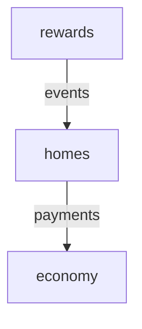

# MinecraftModulith

MinecraftModulith brings **Spring Modulith-style architecture to Minecraft plugins**: one plugin JAR, explicit internal modules, validated dependency boundaries, named public APIs, module events, deterministic lifecycle ordering, diagnostics, and Paper/Folia lifecycle adapters.

> Current version: **0.2.0**

## Install with JitPack

Requires Java 21. Add the repository and the modules you need:

```kotlin
repositories {
    mavenCentral()
    maven("https://jitpack.io")
    maven("https://repo.papermc.io/repository/maven-public/")
}

dependencies {
    implementation("com.github.el211.MinecraftModulith:modulith-paper:v0.2.0")
    annotationProcessor("com.github.el211.MinecraftModulith:modulith-processor:v0.2.0")
    // Optional persistent events and test utilities:
    implementation("com.github.el211.MinecraftModulith:modulith-events-sqlite:v0.2.0")
    testImplementation("com.github.el211.MinecraftModulith:modulith-test:v0.2.0")
    compileOnly("io.papermc.paper:paper-api:1.21.8-R0.1-SNAPSHOT")
}
```

For platform-independent use, depend on `modulith-core` instead of `modulith-paper`.
Bundle runtime dependencies in your plugin JAR, as the example plugin does.

[JitPack builds](https://jitpack.io/#el211/MinecraftModulith/v0.2.0)

## What 0.2 adds

The original 0.1 runtime is now backed by the full second-stage architecture:

- compile-time architecture validation through `modulith-processor`
- named public module APIs through `@ModuleApi("name")`
- `internal` package enforcement between modules
- persistent event publication tracking through SQLite
- sync/async event listeners and completion policies
- module-focused test utilities
- Mermaid and Graphviz dependency graph export
- module/event metrics and runtime diagnostics
- Folia-aware scheduler abstraction
- module-owned dynamic command registration and cleanup
- opt-in YAML configuration per module

## Project layout

```text
modulith-core/           Platform-independent module runtime
modulith-processor/      Annotation processor / architecture validator
modulith-events-sqlite/  Persistent event publication registry
modulith-paper/          Paper + Folia adapters, commands and YAML config
modulith-test/           Module-focused test harness/assertions
example-plugin/          Working example exercising the features
```

## Modules and named APIs

```java
@PluginModule("economy")
public final class EconomyModule implements MinecraftModule, EconomyService {
    @Override
    public void enable(ModuleContext context) {
        context.services().publish(EconomyService.class, this);
    }
}

@ModuleApi("payments")
public interface EconomyService {
    long balance(UUID playerId);
}
```

A consumer can depend on the complete module:

```java
@PluginModule(value = "homes", dependencies = "economy")
```

or only on one named API:

```java
@PluginModule(
    value = "homes",
    dependencies = "economy::payments"
)
```

`ModuleServices.require(...)` enforces the same dependency rule at runtime.

## Compile-time boundary enforcement

Add the processor:

```kotlin
dependencies {
    implementation("com.github.el211.MinecraftModulith:modulith-paper:v0.2.0")
    annotationProcessor("com.github.el211.MinecraftModulith:modulith-processor:v0.2.0")
}
```

The processor rejects:

- duplicate/missing module IDs
- invalid dependency selectors
- access to another module without a declared dependency
- access to another module type that is not marked `@ModuleApi`
- access to packages under another module's `internal` package
- non-public or invalid `@ModuleApi` declarations

Example failure:

```text
Module 'homes' cannot access internal type
dev.example.economy.internal.EconomyRepository
from module 'economy'
```

## Module events

Synchronous listener:

```java
@ModuleListener
public void onHomeCreated(HomeCreatedEvent event) {
}
```

Async listener:

```java
@ModuleListener(
    id = "rewards.home-created",
    delivery = EventDelivery.ASYNC
)
public CompletionStage<Void> onHomeCreated(HomeCreatedEvent event) {
    return CompletableFuture.runAsync(() -> reward(event.playerId()));
}
```

Publishing supports three completion policies:

```java
context.events().publish(event, EventCompletionPolicy.WAIT_FOR_ALL);
context.events().publish(event, EventCompletionPolicy.FAIL_FAST);
context.events().publish(event, EventCompletionPolicy.FIRE_AND_FORGET);
```

`publishAsync(...)` returns a `CompletionStage<EventDispatchResult>`.

## Persistent event publication registry

`modulith-events-sqlite` tracks one durable publication row per listener delivery.

```java
var registry = new SqliteEventPublicationRegistry(
    plugin.getDataFolder().toPath().resolve("modulith-events.db")
);

modulith = PaperModulith.builder(plugin)
    .basePackage("dev.example.plugin")
    .publicationRegistry(registry)
    .start();
```

The registry stores:

- publication UUID
- event type
- listener ID
- serialized payload
- `PENDING`, `COMPLETED`, or `FAILED`
- publication/completion timestamps
- failure text

Incomplete publications can be queried with `registry.incomplete()`.

The bundled default serializer uses `toString()`. Plugins can provide a JSON serializer through `eventSerializer(...)`.

## Optional module configuration

Opt in from the module declaration:

```java
@PluginModule(
    value = "homes",
    configuration = true
)
public final class HomesModule implements MinecraftModule {
    @Override
    public void enable(ModuleContext context) {
        String command = context.config()
            .getString("command-name", "home");
    }
}
```

On Paper the default provider uses:

```text
plugins/<YourPlugin>/modules/homes.yml
```

If `modules/homes.yml` exists inside the plugin JAR it is copied as the default.

Custom platforms can provide their own `ModuleConfigurationProvider`.

## Paper/Folia scheduling

Use the scheduler-safe API:

```java
PaperPlatform paper = context.platform(PaperPlatform.class);

paper.schedule(context, this::tick);
paper.scheduleLater(context, this::later, 20L);
paper.scheduleTimer(context, this::tick, 0L, 20L);
```

MinecraftModulith detects Folia's global region scheduler at runtime and uses it when present. On standard Paper it uses `BukkitScheduler`.

Scheduled work is cancelled automatically when the owning module stops.

## Module-owned commands

Commands can be registered without `plugin.yml` command entries:

```java
paper.registerCommand(
    context,
    "home",
    "Create a home",
    (sender, command, label, args) -> {
        return true;
    }
);
```

The command is unregistered automatically with the module lifecycle.

## Dependency graph export

```java
String mermaid = modulith.runtime().graphMermaid();
String dot = modulith.runtime().graphGraphviz();
```

Example Mermaid output:



## Metrics and diagnostics

```java
RuntimeDiagnostics diagnostics = modulith.runtime().diagnostics();
```

The snapshot contains:

- current module states
- deterministic startup order
- published service count
- incomplete persistent event count
- per-module startup duration
- module start/stop counters
- event publication count
- listener invocation/completion/failure counters
- total listener execution time

No external metrics system is required, so plugins can bridge this snapshot to Prometheus, Micrometer, a web panel, or their own telemetry.

## Module-focused tests

```java
try (ModuleTestHarness harness = ModuleTestHarness.builder()
        .modules(List.of(EconomyModule.class, HomesModule.class))
        .target("homes")
        .start()) {

    harness
        .assertRunning("economy")
        .assertRunning("homes")
        .assertStartupOrder("economy", "homes");
}
```

Only the target and its transitive dependencies are started.

Additional helpers:

```java
ModuleAssertions.assertValidArchitecture(modules);
ModuleAssertions.assertMermaidContains(runtime, "homes");
```

## Paper bootstrap

```java
public final class MyPlugin extends JavaPlugin {
    private PaperModulith modulith;

    @Override
    public void onEnable() {
        modulith = PaperModulith.builder(this)
            .basePackage("dev.example.myplugin")
            .start();
    }

    @Override
    public void onDisable() {
        if (modulith != null) {
            modulith.close();
        }
    }
}
```

## Build

Java 21 is the baseline.

```bash
./gradlew clean build
```

The default Paper API property is:

```properties
paperApiVersion=1.21.8-R0.1-SNAPSHOT
```

The current SQLite JDBC dependency is `org.xerial:sqlite-jdbc:3.53.4.0`.

## License

MIT
