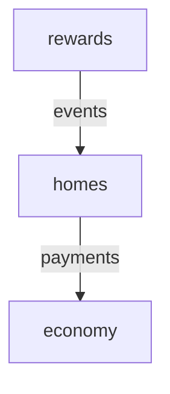

# MinecraftModulith

[](https://jitpack.io/#el211/MinecraftModulith)
[](https://openjdk.org/projects/jdk/21/)
[](https://papermc.io/)
[](LICENSE)

**Spring Modulith-inspired architecture for modern Minecraft plugins.**

MinecraftModulith helps you build large Paper/Folia plugins as a set of explicit, testable modules instead of one tightly coupled codebase. It provides module boundaries, named APIs, dependency validation, lifecycle management, constructor injection, events, event recovery and retry, diagnostics, typed configuration, scheduling adapters, observability, and test utilities while still producing a normal Minecraft plugin.

> **Current release:** `v0.4.0`  
> **Java:** 21  
> **Platform:** Paper 1.21.x + Folia-aware scheduling

## Why MinecraftModulith?

Large plugins often grow into a web of managers, listeners, services, commands, and direct implementation dependencies.

MinecraftModulith gives those systems explicit boundaries:

```text
YourPlugin
├── economy
│   ├── public API
│   └── internal implementation
├── homes
├── warps
├── rewards
└── moderation
```

A module can expose only the API another module is allowed to use:

```java
@ModuleApi("payments")
public interface EconomyService {
    long balance(UUID playerId);
}
```

And consumers can depend on that named API instead of the entire implementation:

```java
@PluginModule(
    value = "homes",
    dependencies = "economy::payments"
)
public final class HomesModule implements MinecraftModule {
}
```

That means fewer accidental dependencies, safer refactors, clearer startup order, and architecture problems caught before they become runtime bugs.

## Installation

MinecraftModulith is available through **JitPack**.

### Gradle Kotlin DSL

```kotlin
repositories {
    mavenCentral()
    maven("https://jitpack.io")
    maven("https://repo.papermc.io/repository/maven-public/")
}

dependencies {
    implementation("com.github.el211.MinecraftModulith:modulith-paper:v0.4.0")

    annotationProcessor(
        "com.github.el211.MinecraftModulith:modulith-processor:v0.4.0"
    )

    // Optional: pick one or more persistence backends
    implementation(
        "com.github.el211.MinecraftModulith:modulith-events-sqlite:v0.4.0"
    )
    implementation(
        "com.github.el211.MinecraftModulith:modulith-events-jdbc:v0.4.0"
    )
    implementation(
        "com.github.el211.MinecraftModulith:modulith-events-mongodb:v0.4.0"
    )

    // Optional: Prometheus / OpenTelemetry reporting
    implementation(
        "com.github.el211.MinecraftModulith:modulith-observability:v0.4.0"
    )

    testImplementation(
        "com.github.el211.MinecraftModulith:modulith-test:v0.4.0"
    )
}
```

For platform-independent usage, use `modulith-core` instead of `modulith-paper`.

### Published modules

| Artifact | Purpose |
| --- | --- |
| `modulith-core` | Platform-independent module runtime, DI, events, services and diagnostics |
| `modulith-paper` | Paper/Folia bootstrap, scheduler, Brigadier commands and YAML configuration |
| `modulith-processor` | Compile-time module and architecture validation |
| `modulith-events-sqlite` | Persistent event publication tracking through SQLite |
| `modulith-events-jdbc` | Persistent event publication tracking through any JDBC data source (PostgreSQL, MySQL, MariaDB, H2, SQL Server, …) |
| `modulith-events-mongodb` | Persistent event publication tracking through MongoDB |
| `modulith-observability` | Dependency-free Prometheus exposition and optional OpenTelemetry reporter |
| `modulith-test` | Module-focused test harness and architecture assertions |

All modules use:

```text
com.github.el211.MinecraftModulith:<artifact>:v0.4.0
```

[JitPack build page](https://jitpack.io/#el211/MinecraftModulith/v0.4.0)

## Quick start

Create a module:

```java
@PluginModule("economy")
public final class EconomyModule implements MinecraftModule, EconomyService {

    @Override
    public void enable(ModuleContext context) {
        context.services().publish(EconomyService.class, this);
    }

    @Override
    public long balance(UUID playerId) {
        return 0L;
    }
}
```

Expose a named API:

```java
@ModuleApi("payments")
public interface EconomyService {
    long balance(UUID playerId);
}
```

Consume it from another module:

```java
@PluginModule(
    value = "homes",
    dependencies = "economy::payments"
)
public final class HomesModule implements MinecraftModule {

    @Override
    public void enable(ModuleContext context) {
        EconomyService economy = context.services()
            .require(EconomyService.class);
    }
}
```

MinecraftModulith validates the declared dependency graph and keeps modules from reaching into implementation details they should not access.

## Package-based module declaration

As an alternative to implementing `MinecraftModule` on a class, you can declare a module directly on a package using `package-info.java`. The annotation processor generates a lifecycle anchor class automatically.

```java
// economy/package-info.java
@ApplicationModule(id = "economy")
package dev.example.economy;

import dev.oreo.modulith.core.ApplicationModule;
```

Named interface packages replace `@ModuleApi` on individual types:

```java
// economy/api/package-info.java
@NamedInterface("payments")
package dev.example.economy.api;

import dev.oreo.modulith.core.NamedInterface;
```

Any public type in that package is now part of the `economy::payments` contract. Other modules declare:

```java
@ApplicationModule(
    id = "homes",
    allowedDependencies = {"economy::payments"}
)
package dev.example.homes;
```

The class-based `@PluginModule` declaration continues to work and the two styles can coexist.

> **Note:** Run a clean build (`./gradlew clean build`) for complete named-API selector validation.
> Incremental builds conservatively skip unknown-API errors when the target module was previously compiled.

## Constructor injection

Mark module-local components with `@ModuleComponent` and MinecraftModulith will construct them
via their public constructor, resolving dependencies from the module's service registry.

```java
@ModuleComponent
public final class HomeRepository {
    private final EconomyService economy;

    // Single public constructor — injected automatically.
    public HomeRepository(EconomyService economy) {
        this.economy = economy;
    }
}
```

When a component has more than one constructor, annotate the chosen one with `@Inject`:

```java
@ModuleComponent
public final class HomeRepository {
    @Inject
    public HomeRepository(EconomyService economy) { ... }

    public HomeRepository() { ... }
}
```

Components are discovered automatically from the module's package when you call
`basePackage(...)` on `PaperModulith.Builder`, or registered explicitly:

```java
PaperModulith.builder(this)
    .basePackage("dev.example.plugin")
    .component("homes", HomeRepository.class)
    .start();
```

## Paper bootstrap

```java
public final class MyPlugin extends JavaPlugin {

    private PaperModulith modulith;

    @Override
    public void onEnable() {
        modulith = PaperModulith.builder(this)
            .basePackage("dev.example.myplugin")
            .diagnosticsCommand(true)   // enables /modulith for admins
            .start();
    }

    @Override
    public void onDisable() {
        if (modulith != null) {
            modulith.close();
        }
    }
}
```

The runtime discovers modules, validates their dependencies, starts them in deterministic order, and shuts them down safely.

## Compile-time architecture validation

Add `modulith-processor` as an annotation processor and invalid architecture can fail during compilation.

The processor detects issues such as:

- duplicate or missing module IDs
- invalid dependency selectors
- access to another module without a declared dependency
- access to types that are not exposed through `@ModuleApi` or `@NamedInterface`
- access to another module's `internal` package
- invalid or non-public module API declarations

Example:

```text
Module 'homes' cannot access internal type
dev.example.economy.internal.EconomyRepository
from module 'economy'
```

## Module events

Use `@ModuleListener` for decoupled module communication.

### Synchronous listener

```java
@ModuleListener
public void onHomeCreated(HomeCreatedEvent event) {
}
```

### Async listener

```java
@ModuleListener(
    id = "rewards.home-created",
    delivery = EventDelivery.ASYNC
)
public CompletionStage<Void> onHomeCreated(HomeCreatedEvent event) {
    return CompletableFuture.runAsync(() -> reward(event.playerId()));
}
```

Publishing supports completion policies:

```java
context.events().publish(event, EventCompletionPolicy.WAIT_FOR_ALL);
context.events().publish(event, EventCompletionPolicy.FAIL_FAST);
context.events().publish(event, EventCompletionPolicy.FIRE_AND_FORGET);
```

`publishAsync(...)` returns a `CompletionStage<EventDispatchResult>`.

## Persistent event publications

The optional persistence modules record event delivery state so that publications that were
in-flight when the server stopped can be detected and replayed on restart.

### SQLite

```java
var registry = new SqliteEventPublicationRegistry(
    plugin.getDataFolder()
        .toPath()
        .resolve("modulith-events.db")
);

modulith = PaperModulith.builder(plugin)
    .basePackage("dev.example.plugin")
    .publicationRegistry(registry)
    .start();
```

### JDBC (PostgreSQL, MySQL, MariaDB, …)

```kotlin
// build.gradle.kts
implementation("com.github.el211.MinecraftModulith:modulith-events-jdbc:v0.4.0")
runtimeOnly("org.postgresql:postgresql:42.7.4")
```

```java
HikariConfig config = new HikariConfig();
config.setJdbcUrl("jdbc:postgresql://localhost:5432/myplugin");
config.setUsername("user");
config.setPassword("secret");
var registry = new JdbcEventPublicationRegistry(new HikariDataSource(config));
```

The schema is created automatically. `JdbcEventPublicationRegistry` also exposes
`begin(Connection, ...)` to enqueue a publication inside a caller-managed SQL transaction.

### MongoDB

```kotlin
// build.gradle.kts
implementation("com.github.el211.MinecraftModulith:modulith-events-mongodb:v0.4.0")
```

```java
MongoClient client = MongoClients.create("mongodb://localhost:27017");
MongoCollection<Document> collection = client
    .getDatabase("myplugin")
    .getCollection("modulith_event_publication");
var registry = new MongoEventPublicationRegistry(collection);
```

An index on `status` is created automatically. `MongoEventPublicationRegistry` also exposes
`begin(ClientSession, ...)` for caller-managed MongoDB transactions.

### Publication statuses

Every persisted delivery record moves through these states:

| Status | Meaning |
| --- | --- |
| `PENDING` | Listener invocation has not yet completed |
| `COMPLETED` | Listener completed successfully |
| `FAILED` | Listener threw an exception |
| `DEAD_LETTER` | Permanently quarantined after exceeding the retry limit |

## Event recovery and retry

To replay publications that were left `PENDING` after a crash, implement `EventPayloadCodec`
so the framework can deserialize stored payloads back into event objects:

```java
public final class JsonEventCodec implements EventPayloadCodec {
    @Override
    public String serialize(Object event) {
        return gson.toJson(event);
    }

    @Override
    public <T> T deserialize(String eventType, String payload, Class<T> type) {
        return gson.fromJson(payload, type);
    }
}
```

Wire it up at bootstrap and replay after all listeners have registered:

```java
modulith = PaperModulith.builder(plugin)
    .publicationRegistry(registry)
    .eventSerializer(new JsonEventCodec())
    .start();

// Replay incomplete publications once all modules are running.
EventRecoveryReport report = modulith.runtime().events().replayIncomplete(100);
```

Failed publications can be retried explicitly or quarantined:

```java
modulith.runtime().events().replayFailed(50);
modulith.runtime().events().deadLetter(publicationId, "poison message");
```

For automatic periodic retry with exponential backoff, use `EventRetryCoordinator`:

```java
EventRetryPolicy policy = new EventRetryPolicy(
    5,                          // max retries
    Duration.ofSeconds(30),     // initial delay
    Duration.ofMinutes(10),     // maximum delay
    2.0                         // backoff multiplier
);

EventRetryCoordinator coordinator = new EventRetryCoordinator(
    modulith.runtime().events(),
    registry,
    policy
);

// Schedule tick() on your preferred execution context.
paper.scheduleTimer(context, () -> {
    EventRetryTickReport report = coordinator.tick(Instant.now(), 20);
}, 0L, 20L * 30); // every 30 seconds
```

> **At-least-once only.** Recovery is not exactly-once. Listeners must be idempotent.
> Run one recovery worker per registry. Distributed leases are not implemented.

## Typed configuration

Define a `record` annotated with `@ConfigKey` and `@ConfigRange`, then read it as an
immutable snapshot from `ModuleConfiguration`:

```java
public record HomesSettings(
    @ConfigKey("command-name") String commandName,
    @ConfigKey("max-homes") @ConfigRange(min = 1, max = 100) int maxHomes
) {}
```

```java
@Override
public void enable(ModuleContext context) {
    HomesSettings settings = TypedModuleConfiguration.read(
        context.config(), HomesSettings.class
    );
    int limit = settings.maxHomes();
}
```

Validation and type conversion happen at startup; missing or out-of-range values throw
`ModulithException` before the module finishes enabling.

## Module configuration

Modules can opt into their own YAML configuration file:

```java
@PluginModule(
    value = "homes",
    configuration = true
)
public final class HomesModule implements MinecraftModule {

    @Override
    public void enable(ModuleContext context) {
        String command = context.config()
            .getString("command-name", "home");
    }
}
```

On Paper, module configuration is stored under:

```text
plugins/<YourPlugin>/modules/<module>.yml
```

Bundled module YAML files can be copied from the plugin JAR as defaults.

## Paper & Folia scheduling

MinecraftModulith provides a scheduler abstraction so module code does not need to care whether it is running on standard Paper or Folia.

```java
PaperPlatform paper = context.platform(PaperPlatform.class);

paper.schedule(context, this::tick);
paper.scheduleLater(context, this::later, 20L);
paper.scheduleTimer(context, this::tick, 0L, 20L);
```

MinecraftModulith detects Folia's global region scheduler when available and otherwise uses Paper's `BukkitScheduler`.

Scheduled tasks owned by a module are cancelled automatically when that module stops.

## Folia scheduling contexts

For full Folia compatibility, access explicit scheduling contexts through `ModuleScheduler`:

```java
ModuleScheduler contexts = context.platform(PaperPlatform.class).contexts();

// Global context (equivalent to Folia's global region scheduler)
contexts.global(context, this::tick);

// Region context — required for world-state access on Folia
contexts.region(context, location, this::processChunk);

// Entity context — required for entity-state access on Folia
contexts.entity(context, entity, this::moveEntity);

// Async context
contexts.async(context, this::fetchFromDatabase);
```

All returned task handles are owned by the module's lifecycle and cancelled automatically on disable.

## Module-owned commands

### Legacy command registration

Commands can be registered dynamically without declaring every command in `plugin.yml`.

```java
paper.registerCommand(
    context,
    "home",
    "Create a home",
    (sender, command, label, args) -> {
        return true;
    }
);
```

### Lifecycle-based Brigadier registration

Use `registerBasicCommand` to register commands through Paper's lifecycle event system.
The command is skipped if the owning module has already been disabled:

```java
paper.registerBasicCommand(
    context,
    "home",
    "Create a home",
    List.of("h"),
    (source, args) -> source.getSender().sendMessage("Home!")
);
```

Registered commands are cleaned up with their owning module lifecycle.

## Administrator diagnostics command

Enable the built-in `/modulith` command at bootstrap. Access requires the
`minecraftmodulith.admin` permission:

```java
PaperModulith.builder(this)
    .basePackage("dev.example.myplugin")
    .diagnosticsCommand(true)
    .start();
```

| Subcommand | Output |
| --- | --- |
| `/modulith modules` | All module IDs and their current state |
| `/modulith events` | Published, completed, failed, and incomplete event counts |
| `/modulith graph` | Mermaid module dependency graph sent to the sender |

## Observability

`modulith-observability` provides pull-based Prometheus text exposition and an optional
OpenTelemetry push adapter with no mandatory runtime dependencies.

### Prometheus

```java
// In your HTTP handler or metrics endpoint:
String metrics = ModulithPrometheusExporter.render(modulith.runtime());
```

Exposed metrics include event publication counts, listener invocation/completion/failure counts,
incomplete publication count, and per-module start/stop counters and startup durations.

### OpenTelemetry

```java
Meter meter = openTelemetrySdk.getMeter("dev.example.myplugin");
OpenTelemetryModulithReporter reporter = new OpenTelemetryModulithReporter(meter);

// Call periodically on any thread — synchronized internally.
paper.scheduleTimer(context, () -> reporter.collect(modulith.runtime()), 0L, 20L * 60);
```

The reporter uses delta counters to avoid double-counting on repeated `collect()` calls.

## ServiceLoader contributors

If your project distributes modules across multiple JARs, implement `ModuleContributor` to
expose them through the Java ServiceLoader:

```java
// In a separate library JAR:
public final class EconomyContributor implements ModuleContributor {
    @Override
    public Collection<Class<? extends MinecraftModule>> modules() {
        return List.of(EconomyModule.class);
    }
}
```

Register it in `META-INF/services/dev.oreo.modulith.core.ModuleContributor`, then enable
discovery at bootstrap:

```java
PaperModulith.builder(this)
    .discoverContributors(true)
    .start();
```

> A dedicated cross-plugin classloader bridge is not implied. Contributors are intended for
> modules co-deployed in the same JAR or on the same classloader.

## Dependency graph export

The runtime can export the module graph for documentation and diagnostics.

```java
String mermaid = modulith.runtime().graphMermaid();
String graphviz = modulith.runtime().graphGraphviz();
```

Example:



## Metrics & diagnostics

```java
RuntimeDiagnostics diagnostics = modulith.runtime().diagnostics();
```

The diagnostics snapshot exposes information such as:

- module states
- deterministic startup order
- published service count
- module startup duration
- module start/stop counters
- event publication count
- listener invocation/completion/failure counters
- total listener execution time
- incomplete persistent publications

You can bridge these diagnostics into Prometheus, Micrometer, a web dashboard, or your own telemetry system.

## Module-focused testing

`modulith-test` lets tests start only a target module and its required dependencies.

```java
try (ModuleTestHarness harness = ModuleTestHarness.builder()
        .modules(List.of(EconomyModule.class, HomesModule.class))
        .target("homes")
        .start()) {

    harness
        .assertRunning("economy")
        .assertRunning("homes")
        .assertStartupOrder("economy", "homes");
}
```

### JUnit 5 annotation

Use `@MinecraftModuleTest` to start modules once per test class and inject them as
parameters. The harness is closed automatically after all tests in the class finish.

```java
@MinecraftModuleTest(
    value = "homes",
    modules = {EconomyModule.class, HomesModule.class}
)
class HomesModuleTest {

    @Test
    void startsRequiredModules(ModuleTestHarness harness, ModuleRuntime runtime) {
        harness.assertRunning("economy").assertRunning("homes");
        assertEquals(2, runtime.modules().size());
    }

    @Test
    void diagnosticsReflectRunningState(RuntimeDiagnostics diagnostics) {
        assertEquals(ModuleState.RUNNING, diagnostics.states().get("homes"));
    }
}
```

Supported injection types: `ModuleTestHarness`, `ModuleRuntime`, `EventBus`, `RuntimeDiagnostics`.

### Architecture helpers

```java
ModuleAssertions.assertValidArchitecture(modules);
ModuleAssertions.assertMermaidContains(runtime, "homes");
```

## Gradle plugin

`modulith-gradle-plugin` adds build tasks that consume the processor-generated `modules.idx`
metadata file.

```kotlin
// settings.gradle.kts
pluginManagement {
    repositories { maven("https://jitpack.io") }
}
```

```kotlin
// build.gradle.kts
plugins {
    id("dev.oreo.modulith") version "v0.4.0"
}
```

| Task | Description |
| --- | --- |
| `verifyModulith` | Validates the module metadata file; fails if no modules were found |
| `modulithDocs` | Generates `build/reports/modulith/modules.md` and `modules.mmd` |
| `modulithGraph` | Depends on `modulithDocs`; entry point for graph generation |
| `modulithTest` | Alias for `test`; groups module-focused test runs |

Projects without `modulith-processor` on the annotation processor classpath will fail
`verifyModulith` intentionally.

## Feature overview

| Feature | MinecraftModulith |
| --- | :---: |
| Explicit plugin modules | ✅ |
| Package-based module declaration | ✅ |
| Named public APIs (`@ModuleApi` / `@NamedInterface`) | ✅ |
| Constructor injection (`@ModuleComponent`) | ✅ |
| Compile-time architecture validation | ✅ |
| Runtime dependency validation | ✅ |
| Deterministic lifecycle ordering | ✅ |
| Module event bus | ✅ |
| Async event delivery | ✅ |
| Event completion policies | ✅ |
| SQLite publication tracking | ✅ |
| JDBC publication tracking (PostgreSQL, MySQL, MariaDB, …) | ✅ |
| MongoDB publication tracking | ✅ |
| Event recovery and at-least-once replay | ✅ |
| Automatic retry with exponential backoff | ✅ |
| Dead-letter quarantine | ✅ |
| Typed record configuration (`@ConfigKey` / `@ConfigRange`) | ✅ |
| Paper integration | ✅ |
| Folia-aware scheduling | ✅ |
| Explicit Folia region / entity scheduling contexts | ✅ |
| Module-owned commands (legacy + Brigadier) | ✅ |
| Built-in admin diagnostics command | ✅ |
| Per-module YAML configuration | ✅ |
| Mermaid/Graphviz export | ✅ |
| Runtime metrics & diagnostics | ✅ |
| Prometheus exposition | ✅ |
| OpenTelemetry reporter | ✅ |
| ServiceLoader module contributors | ✅ |
| Module-focused test harness | ✅ |
| JUnit 5 `@MinecraftModuleTest` extension | ✅ |
| Gradle verification and docs tasks | ✅ |

## Project structure

```text
modulith-core/            Core module runtime, DI, events, services
modulith-processor/       Compile-time architecture validator
modulith-events-sqlite/   SQLite publication registry
modulith-events-jdbc/     JDBC publication registry (PostgreSQL, MySQL, MariaDB, …)
modulith-events-mongodb/  MongoDB publication registry
modulith-paper/           Paper + Folia integration
modulith-observability/   Prometheus and OpenTelemetry adapters
modulith-gradle-plugin/   Gradle verification and docs tasks
modulith-test/            Testing utilities
example-plugin/           Example implementation
```

## Requirements

- Java 21
- Gradle 8+ / wrapper included
- Paper 1.21.x for `modulith-paper`
- SQLite JDBC bundled when using `modulith-events-sqlite`
- Any JDBC driver when using `modulith-events-jdbc` (PostgreSQL, MySQL, MariaDB, etc.)
- MongoDB Java driver 5.x bundled when using `modulith-events-mongodb`
- OpenTelemetry API on the classpath when using `OpenTelemetryModulithReporter`

Default Paper API:

```properties
paperApiVersion=1.21.8-R0.1-SNAPSHOT
```

## Building from source

```bash
git clone https://github.com/el211/MinecraftModulith.git
cd MinecraftModulith
./gradlew clean build
```

To publish all library modules to your local Maven repository:

```bash
./gradlew publishToMavenLocal
```

## Version

Current release:

```text
v0.4.0
```

## License

MinecraftModulith is released under the [MIT License](LICENSE).

---

Built for developers who want large Minecraft plugins to stay modular, testable, and maintainable.
